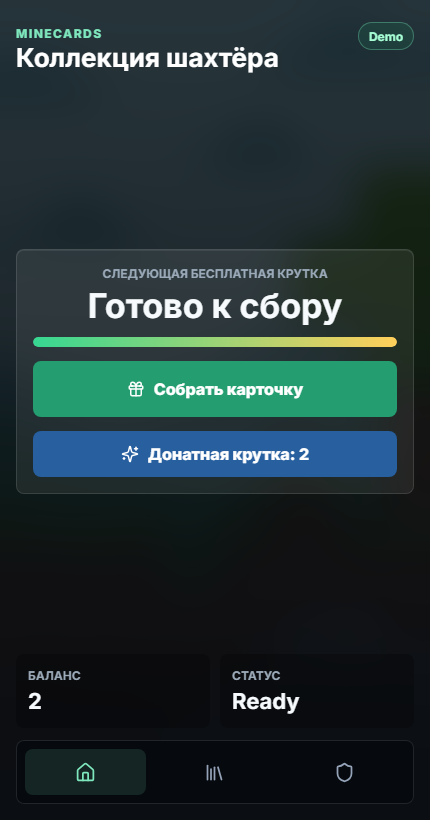
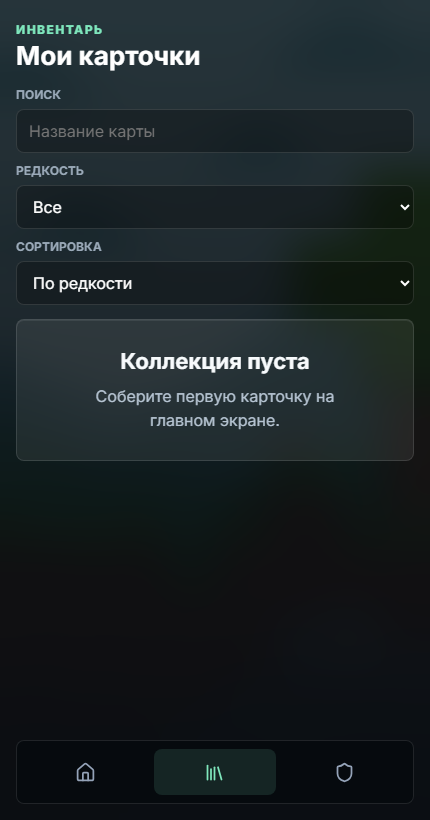

# MineCards

MineCards - Telegram Mini App с карточной gacha-механикой: игрок забирает бесплатную крутку по таймеру, открывает случайную карту, собирает коллекцию и может использовать дополнительные платные крутки.

Проект подготовлен как fullstack-приложение для релиза: React + TypeScript на клиенте, Node.js/Express API, MySQL-хранилище, строгая проверка Telegram Mini App init data и локальный mock-режим только для разработки.

## Demo

- Telegram bot: https://t.me/SvinCards_bot/
- Локальный запуск: `npm run dev`

## Screenshots





## Возможности

- Бесплатная карточная крутка с 6-часовым cooldown.
- Платные крутки с отдельным балансом.
- Модальное открытие новой карточки со звуком и визуальным эффектом.
- Коллекция с поиском, фильтром по редкости и сортировкой.
- Карточка сущности с изображением, редкостью и количеством копий.
- Админ-панель для выдачи круток одному игроку или всем игрокам.
- Валидация форм, подтверждение массовой операции, loading/error/empty/success states.
- Not found page для неизвестных маршрутов.
- Mobile-first интерфейс под Telegram Mini Apps.

## Стек

- React 18
- TypeScript strict mode
- Vite
- React Router
- Zustand
- Node.js + Express
- MySQL через `mysql2`
- Telegram Mini App init data auth
- REST API + dev mock API

## Что сделано для релиза

- Пользовательские API больше не доверяют `telegram_id` из body/query: пользователь определяется только по подписанному Telegram init data.
- Админские действия требуют валидный Telegram init data и совпадение с `ADMIN_TELEGRAM_ID`.
- Админская выдача переведена на POST, GET-мутации отключены.
- Cron endpoint `/api/notify_ready.php` защищён `CRON_SECRET`.
- Создание трейда проверяет, что карточка принадлежит текущему пользователю.
- Бесплатные/платные крутки выполняются внутри транзакции с блокировкой строки пользователя.
- Выбор карточки на сервере использует `crypto.randomInt`, а не `Math.random()`.
- Включены базовые security headers, лимит размера JSON body и простой rate limit для `/api`.
- Production-запуск использует `server/server.mjs` и раздаёт собранный `dist`, без Vite middleware.
- Production sourcemap отключён по умолчанию.
- Секреты и локальные артефакты исключены через `.gitignore`.

## Архитектура

```text
src/
  app/              application shell and routes
  entities/         domain types and constants
  hooks/            reusable React hooks
  pages/            route pages
  shared/
    api/            typed real/mock API clients and mappers
    lib/            formatting and rarity helpers
    ui/             reusable UI components
  store/            Zustand store
  styles/           global app styles
server/
  db.mjs            MySQL pool and transaction helpers
  dev-server.mjs    local Vite + API server
  game-api.mjs      game REST API
  security.mjs      headers and API rate limiting
  server.mjs        production static + API server
database/
  schema.sql        MySQL schema, indexes, constraints and seed cards
docs/screenshots/   README screenshots
```

## Локальная разработка

```bash
npm install
cp .env.example .env
npm run db:setup
npm run dev
```

На Windows PowerShell:

```powershell
Copy-Item .env.example .env
npm run db:setup
npm run dev
```

Откройте http://127.0.0.1:5173.

Если приложение открыто вне Telegram и `VITE_API_MODE=auto`, клиент использует локальный mock API в `localStorage`. Это удобно для разработки интерфейса, но не заменяет серверную авторизацию.

## Database

Схема MySQL лежит в `database/schema.sql`. Она создаёт:

- `users` - Telegram-профили и баланс платных круток.
- `cards` - справочник карточек, редкость, стабильный `image_url` и `drop_rate`.
- `user_cards` - экземпляры карточек в коллекциях игроков.
- `claim_cooldowns` - время последней бесплатной крутки.
- `trades` и `trade_items` - заготовка для обменов.
- `notified_users` - защита от повторной отправки cron-уведомлений.

Применить схему и seed-карты можно командой:

```bash
npm run db:setup
```

Команда читает `DB_HOST`, `DB_PORT`, `DB_USER` и `DB_PASSWORD` из `.env`. Пользователь MySQL должен иметь права на `CREATE DATABASE`, `CREATE TABLE`, `ALTER`, `INSERT` и `UPDATE`.

Для TiDB Cloud Starter укажите `DB_PORT=4000` и `DB_SSL=true`. `DB_SSL_CA_PATH` обычно можно оставить пустым на Linux-хостинге с системными root certificates.

## Production build

```bash
npm run build
npm start
```

`npm start` запускает Express-сервер, который обслуживает `/api/*` и статический `dist`.

## Environment

```env
PORT=5173
HOST=127.0.0.1
JSON_BODY_LIMIT=32kb
API_RATE_LIMIT_WINDOW_MS=60000
API_RATE_LIMIT_MAX=120

DB_HOST=localhost
DB_PORT=3306
DB_NAME=minecards
DB_USER=root
DB_PASSWORD=
DB_CONNECTION_LIMIT=10
DB_SSL=false
DB_SSL_CA_PATH=

ADMIN_TELEGRAM_ID=7212088382
TELEGRAM_BOT_TOKEN=
TELEGRAM_AUTH_MAX_AGE_SECONDS=604800
CRON_SECRET=
MAX_ADMIN_REWARD_COUNT=1000

VITE_API_MODE=auto
VITE_API_BASE=/api
VITE_ADMIN_TELEGRAM_ID=7212088382
VITE_BUILD_SOURCEMAP=false
```

### Обязательные переменные для релиза

- `TELEGRAM_BOT_TOKEN` - нужен для проверки Telegram init data и отправки уведомлений.
- `ADMIN_TELEGRAM_ID` - серверная проверка прав администратора.
- `VITE_ADMIN_TELEGRAM_ID` - только показ админ-вкладки на клиенте; безопасность всё равно проверяет сервер.
- `CRON_SECRET` - секрет для `/api/notify_ready.php`.
- `DB_*` - подключение к MySQL.

## API mode

- `VITE_API_MODE=auto` - в Telegram используется реальный API, вне Telegram используется mock API.
- `VITE_API_MODE=mock` - всегда используется localStorage mock API.
- `VITE_API_MODE=real` - всегда используется Node.js API.

## Cron notifications

Для отправки уведомлений о готовой бесплатной крутке вызовите endpoint с секретом:

```bash
curl -X POST http://127.0.0.1:5173/api/notify_ready.php \
  -H "Authorization: Bearer <CRON_SECRET>"
```

## Checks

```bash
npm run build
npm audit
```
